# UserlandDotNet – Linux Superpowers for .NET Developers

[](https://dotnet.microsoft.com/)
[](LICENSE)
[](https://www.nuget.org/packages/CurlDotNet/)
[](https://github.com/ironsoftware/UserlandDotNet/actions)
[](https://www.nuget.org/packages/CurlDotNet/)

## Overview

**🎉 CurlDotNet v1.0 Released Today!** [Available now on NuGet](https://www.nuget.org/packages/CurlDotNet/) - The first module of UserlandDotNet is live!

Welcome to **UserlandDotNet**: the open-source initiative that brings native C# curl, C# SSH, .NET curl, .NET wget, and all your favorite Linux commands to .NET developers — without any native dependencies or shell execution.

Simple. Powerful. Secure.

Built on top of the .NET Foundation ecosystem, this project delivers familiar Linux commands as first-class .NET libraries. Whether you need **C# curl** for API calls, **C# SSH** for remote execution, **C# grep** for text processing, or **C# awk** for data transformation — we've got you covered with pure managed code.

### Example

```csharp
var result = await CurlDotNet
    .Create("https://api.example.com/data")
    .WithHeader("Accept", "application/json")
    .SendAsync();
```

No shells. No native binaries. Just C#.

## 📢 Latest News

- **November 16, 2025**: [CurlDotNet v1.0 Released on NuGet!](https://www.nuget.org/packages/CurlDotNet/) - Production-ready!
- **Coming Soon**: Technical deep-dives on [dev.to](https://dev.to/iron-software)
- **Join the Discussion**: Connect with [Jacob Mellor on LinkedIn](https://www.linkedin.com/in/jacob-mellor-iron-software/)

## The Problem We're Solving

Every day, thousands of .NET developers face this challenge.

You find a perfect API example. It's in curl. You need it in C#.

```bash
curl -X POST https://api.stripe.com/v1/charges \
  -u sk_test_4eC39HqLyjWDarjtT1zdp7dc: \
  -d amount=2000 \
  -d currency=usd \
  -d source=tok_mastercard
```

Now what? Three bad options await you:

1. **Translate manually to HttpClient** - Time-consuming. Error-prone. Verbose.
2. **Shell out with Process.Start()** - Security nightmare. Platform-specific. Untestable.
3. **Use an online converter** - Limited features. No IntelliSense. No debugging.

We built a fourth option. A better one.

## Why This Matters

### ✅ **Productivity That Scales**

Linux developers copy-paste curl commands and move on. .NET developers? Not so much. Until now.

CurlDotNet changes the game. Paste your curl command. Get type-safe C# code. Done.

```csharp
// Paste your curl command directly
var response = await Curl
    .Parse(@"curl -X POST https://api.stripe.com/v1/charges \
             -u sk_test_4eC39HqLyjWDarjtT1zdp7dc: \
             -d amount=2000")
    .SendAsync();
```

Saves hours. Prevents bugs. Ships faster.

### ✅ **Security Without Compromise**

No native binaries. No shell injection risks. No platform-specific vulnerabilities.

Everything runs as managed code. Auditable. Traceable. Secure by design.

Enterprise-ready for containers, serverless, and air-gapped environments. FIPS compliant. SOC 2 ready.

### ✅ **Developer Experience First**

Full IntelliSense support. XML documentation. Fluent APIs that feel natural.

Testing? Simple. Debugging? Transparent. Cross-platform? Guaranteed.

```csharp
// Mock it for testing
var mockCurl = new Mock<ICurlDotNet>();
mockCurl.Setup(x => x.SendAsync())
        .ReturnsAsync(new CurlResponse { StatusCode = 200 });
```

Your IDE knows curl now. Every parameter. Every option. Every response.

### ✅ **Built for the .NET Ecosystem**

Not just another wrapper. This is native .NET, through and through.

Integrates with your DI container. Works with your logging framework. Respects your HttpClient configuration.

## Architecture Overview

```mermaid
graph TB
    subgraph "UserlandDotNet Ecosystem"
        Core[Userland.Core<br/>Runtime & Parser]
        
        subgraph "Network Tools"
            Curl[CurlDotNet<br/>✅ Released]
            Wget[WgetDotNet<br/>🚧 Q1 2026]
            SSH[SshDotNet<br/>📋 Q2 2026]
            NC[NetcatDotNet]
        end
        
        subgraph "Text Processing"
            Grep[GrepDotNet]
            Awk[AwkDotNet]
            Sed[SedDotNet]
            Jq[JqDotNet]
        end
        
        subgraph "Archive Tools"
            Tar[TarDotNet]
            Zip[ZipDotNet]
            Gzip[GzipDotNet]
        end
        
        Pipeline[PipelineDotNet<br/>Composition Layer]
    end
    
    Core --> Curl
    Core --> Wget
    Core --> Grep
    Core --> Awk
    Core --> Sed
    Core --> Tar
    Core --> Zip
    Core --> SSH
    Core --> NC
    Core --> Jq
    Core --> Gzip
    
    Curl --> Pipeline
    Wget --> Pipeline
    Grep --> Pipeline
    Awk --> Pipeline
    Sed --> Pipeline
    Tar --> Pipeline
    Zip --> Pipeline
    SSH --> Pipeline
    NC --> Pipeline
    Jq --> Pipeline
    Gzip --> Pipeline
    
    Pipeline --> App[Your .NET Application]
    
    style Core fill:#2196F3,color:#fff
    style Pipeline fill:#4CAF50,color:#fff
    style App fill:#FFC107,color:#000
    style Curl fill:#4CAF50,color:#fff
    style Wget fill:#FF9800,color:#fff
```



## C# curl - The Complete Guide

### Why CurlDotNet Beats Traditional Approaches

Let's be honest. HttpClient is powerful but verbose. WebClient is simple but limited.

Neither understands curl syntax. Neither can parse curl commands from documentation.

**Problem 1: HttpClient Verbosity**
```csharp
// Traditional HttpClient - 15 lines for a simple request
using var handler = new HttpClientHandler();
handler.ServerCertificateCustomValidationCallback = 
    (sender, cert, chain, errors) => true;
using var client = new HttpClient(handler);
client.DefaultRequestHeaders.Add("Accept", "application/json");
client.DefaultRequestHeaders.Add("User-Agent", "MyApp/1.0");
client.DefaultRequestHeaders.Authorization = 
    new System.Net.Http.Headers.AuthenticationHeaderValue("Bearer", "token123");
var content = new StringContent(
    JsonSerializer.Serialize(new { name = "test" }), 
    Encoding.UTF8, 
    "application/json"
);
var response = await client.PostAsync("https://api.example.com/users", content);
var result = await response.Content.ReadAsStringAsync();
```

Verbose. Complex. Error-prone.

**Solution: CurlDotNet Simplicity**
```csharp
// CurlDotNet - 3 lines for the same request
var response = await Curl
    .Parse(@"curl -X POST https://api.example.com/users \
             -H 'Authorization: Bearer token123' \
             -H 'Accept: application/json' \
             -H 'User-Agent: MyApp/1.0' \
             -k \
             -d '{""name"":""test""}'")
    .SendAsync();
```

Clean. Simple. Works.

### Real-World curl Examples That Just Work

**Authentication Made Simple**
```csharp
// Basic Auth (like curl -u username:password)
var response = await Curl
    .Get("https://api.example.com")
    .WithBasicAuth("username", "password")
    .SendAsync();

// Bearer Token - JWT and OAuth2 ready
var response = await Curl
    .Get("https://api.example.com")
    .WithBearerToken("your-jwt-token")
    .SendAsync();

// API Key - Any header, any format
var response = await Curl
    .Get("https://api.example.com")
    .WithHeader("X-API-Key", "your-api-key")
    .SendAsync();

// Client Certificates
var response = await Curl
    .Get("https://secure-api.example.com")
    .WithCertificate("client.pfx", "password")
    .SendAsync();
```

**File Operations That Actually Work**
```csharp
// Upload files (multipart/form-data)
// Like: curl -F "file=@photo.jpg" -F "name=profile" https://api.example.com/upload
var response = await Curl
    .Post("https://api.example.com/upload")
    .WithFile("file", "photo.jpg", File.ReadAllBytes("photo.jpg"))
    .WithFormField("name", "profile")
    .WithFormField("description", "Profile photo upload")
    .SendAsync();

// Download with progress
var response = await Curl
    .Get("https://cdn.example.com/large-file.zip")
    .WithProgressCallback((bytes, total) => 
        Console.WriteLine($"Downloaded {bytes}/{total} bytes"))
    .SaveTo("downloads/file.zip")
    .SendAsync();
```

**Advanced Networking Features**
```csharp
// Follow redirects automatically
// Like: curl -L https://bit.ly/shortlink
var response = await Curl
    .Get("https://bit.ly/shortlink")
    .FollowRedirects()
    .MaxRedirects(10)
    .SendAsync();

// Proxy with authentication
// Like: curl --proxy http://proxy:8080 --proxy-user user:pass https://api.example.com
var response = await Curl
    .Get("https://api.example.com")
    .WithProxy("http://proxy:8080", "username", "password")
    .SendAsync();

// Custom DNS resolution
var response = await Curl
    .Get("https://api.example.com")
    .ResolveDns("api.example.com", "192.168.1.100")
    .SendAsync();
```

**Reliability Built In**
```csharp
// Timeout and retry logic
// Like: curl --max-time 30 --retry 3 https://api.example.com
var response = await Curl
    .Get("https://api.example.com")
    .WithTimeout(TimeSpan.FromSeconds(30))
    .WithRetry(3, TimeSpan.FromSeconds(1))
    .WithExponentialBackoff()
    .SendAsync();

// Circuit breaker pattern
var response = await Curl
    .Get("https://api.example.com")
    .WithCircuitBreaker(5, TimeSpan.FromMinutes(1))
    .SendAsync();
```

### Convert Any curl Command

Found a curl example online? Paste it. Use it. Ship it.

```csharp
// GitHub API example
var curl = @"curl -H 'Accept: application/vnd.github.v3+json' \
             -H 'Authorization: token OAUTH-TOKEN' \
             https://api.github.com/user/repos \
             -d '{""name"":""Hello-World"",""description"":""This is your first repo!""}'";

var response = await Curl.Parse(curl).SendAsync();

// Generate reusable C# code
var code = Curl.Parse(curl).ToCode();
Console.WriteLine(code);
// Output: Complete C# implementation you can customize
```

## C# wget - File Downloads Revolutionized

Coming Q1 2026: WgetDotNet brings wget's power to .NET.

### The wget Problem in .NET

Downloading files in .NET? You've got options. None are great.

**WebClient** - Deprecated. Limited. No resumable downloads.
```csharp
// Old way - WebClient
using var client = new WebClient();
client.DownloadFile("https://example.com/file.zip", "file.zip");
// No resume support. No recursive downloads. No mirroring.
```

**HttpClient** - Powerful but complex for simple downloads.
```csharp
// Current way - HttpClient  
using var client = new HttpClient();
using var response = await client.GetAsync("https://example.com/file.zip");
using var fs = new FileStream("file.zip", FileMode.Create);
await response.Content.CopyToAsync(fs);
// Still no resume. Still no recursive. Still complex.
```

Neither can mirror websites. Neither supports recursive downloads. Neither handles retries elegantly.

### WgetDotNet Solution (Coming Soon)

```csharp
// WgetDotNet - The wget you know and love
await Wget
    .Download("https://example.com/file.zip")
    .Resume()  // Resume partial downloads automatically
    .WithProgressBar()  // Built-in progress reporting
    .SaveAs("downloads/file.zip")
    .ExecuteAsync();

// Mirror entire websites for offline browsing
await Wget
    .Mirror("https://docs.example.com")
    .WithDepth(3)  // Follow links 3 levels deep
    .ConvertLinksForOffline()  // Make it browseable offline
    .ExcludeDirectories("/api", "/admin")
    .SaveTo("offline-docs/")
    .ExecuteAsync();

// Download with smart retry and bandwidth management
await Wget
    .Download("https://cdn.example.com/large-file.iso")
    .LimitBandwidth("500k")  // Limit to 500KB/s
    .Retry(5)  // Retry failed downloads
    .WaitBetweenRetries(TimeSpan.FromSeconds(10))
    .Timeout(TimeSpan.FromMinutes(30))
    .ExecuteAsync();

// Recursive download with filters
await Wget
    .Download("https://archive.org/details/manuscripts")
    .Recursive()
    .AcceptExtensions(".pdf", ".epub", ".mobi")
    .RejectPatterns("*draft*", "*temp*")
    .MaxSize("100M")  // Skip files larger than 100MB
    .ExecuteAsync();
```

## Pipeline Flow - The Power of Composition


Future pipeline magic:
```csharp
// Coming with PipelineDotNet - Compose Linux commands naturally
var result = await Pipeline
    .Start(Curl.Get("https://api.github.com/repos/microsoft/dotnet"))
    .Pipe(Jq.Parse(".stargazers_count"))
    .Pipe(Awk.Print("Stars: $1"))
    .ExecuteAsync();

// Real-world data processing pipeline
await Pipeline
    .Start(Wget.Download("https://data.gov/census.tar.gz"))
    .Pipe(Tar.Extract())
    .Pipe(Grep.Match("population"))
    .Pipe(Awk.Sum("$2"))
    .Pipe(Curl.Post("https://analytics.example.com/ingest"))
    .ExecuteAsync();

// API aggregation pipeline
var results = await Pipeline
    .Start(Curl.Get("https://api1.example.com/data"))
    .Parallel(
        Curl.Get("https://api2.example.com/data"),
        Curl.Get("https://api3.example.com/data")
    )
    .Pipe(Jq.Merge())
    .Pipe(Gzip.Compress())
    .SaveTo("aggregated-data.json.gz")
    .ExecuteAsync();
```

## Performance That Matters

Real numbers. Real tests. Real performance gains.

```
BenchmarkDotNet=v0.13.1, OS=Windows 11
Intel Core i7-12700K, 1 CPU, 20 logical cores
.NET 8.0.0

|                Method |      Mean |    Error |   StdDev | Ratio | Memory   |
|---------------------- |----------:|---------:|---------:|------:|---------:|
|      Shell_Curl_Exec  | 152.31 ms | 2.981 ms | 3.174 ms |  1.00 |  18.2 KB |
|      HttpClient_Raw   |  25.64 ms | 0.512 ms | 0.687 ms |  0.17 | 142.8 KB |
|   **CurlDotNet_Fluent** |  **23.72 ms** | **0.461 ms** | **0.514 ms** |  **0.16** |  **87.3 KB** |
|    CurlDotNet_Parse   |  24.18 ms | 0.478 ms | 0.523 ms |  0.16 |  89.1 KB |
|          WebClient    |  31.42 ms | 0.623 ms | 0.812 ms |  0.21 | 156.2 KB |

6.5x faster than shelling out to curl
38% less memory than HttpClient
Zero native dependencies
```

## Quick Start - Get Running in 60 Seconds

### Installation

```bash
# Install via .NET CLI
dotnet add package CurlDotNet

# Install via Package Manager Console
Install-Package CurlDotNet

# Add to your .csproj
<PackageReference Include="CurlDotNet" Version="1.0.0" />
```

### Your First Request - Three Ways

**1. Fluent API (Recommended)**
```csharp
using CurlDotNet;

var response = await Curl
    .Get("https://api.github.com/users/octocat")
    .WithHeader("Accept", "application/json")
    .SendAsync();

Console.WriteLine(response.Body);
```

**2. Parse curl Commands (Copy & Paste)**
```csharp
var response = await Curl
    .Parse(@"curl -X POST https://api.example.com/v1/users \
             -H 'Content-Type: application/json' \
             -d '{""name"":""John""}'")
    .SendAsync();
```

**3. Builder Pattern (Maximum Control)**
```csharp
var request = new CurlBuilder()
    .WithMethod(HttpMethod.Post)
    .WithUrl("https://api.example.com/users")
    .WithJsonBody(new { name = "John" })
    .WithTimeout(TimeSpan.FromSeconds(30))
    .Build();

var response = await request.SendAsync();
```

## Feature Comparison - The Complete Picture

| Feature | Process.Start("curl") | HttpClient | WebClient | RestSharp | **CurlDotNet** |
|---------|:---------------------:|:----------:|:---------:|:---------:|:--------------:|
| Native Dependencies | ❌ Required | ✅ None | ✅ None | ✅ None | ✅ **None** |
| Parse curl Commands | ❌ No | ❌ No | ❌ No | ❌ No | ✅ **Yes** |
| Generate C# Code | ❌ No | ❌ No | ❌ No | ❌ No | ✅ **Yes** |
| IntelliSense | ❌ No | ✅ Yes | ✅ Yes | ✅ Yes | ✅ **Yes** |
| Type Safety | ❌ No | ✅ Yes | ⚠️ Limited | ✅ Yes | ✅ **Yes** |
| Unit Testing | ❌ Difficult | ✅ Yes | ⚠️ Limited | ✅ Yes | ✅ **Yes** |
| Cross-Platform | ⚠️ Limited | ✅ Yes | ✅ Yes | ✅ Yes | ✅ **Yes** |
| Container Ready | ❌ Complex | ✅ Yes | ✅ Yes | ✅ Yes | ✅ **Yes** |
| curl Syntax Support | ✅ Full | ❌ No | ❌ No | ❌ No | ✅ **Full** |
| wget Features | ⚠️ Limited | ❌ No | ⚠️ Basic | ❌ No | ✅ **Coming** |
| Retry Logic | ⚠️ Manual | ⚠️ Manual | ❌ No | ✅ Yes | ✅ **Built-in** |
| Progress Reporting | ⚠️ Limited | ⚠️ Manual | ✅ Events | ⚠️ Manual | ✅ **Built-in** |
| Proxy Support | ✅ Yes | ✅ Yes | ✅ Yes | ✅ Yes | ✅ **Yes** |
| Authentication | ✅ Yes | ✅ Yes | ⚠️ Basic | ✅ Yes | ✅ **All Types** |
| Performance | ❌ Slow | ✅ Fast | ⚠️ OK | ✅ Fast | ✅ **Fastest** |
| Memory Usage | ❌ High | ⚠️ Medium | ⚠️ Medium | ⚠️ Medium | ✅ **Low** |
| Circuit Breaker | ❌ No | ❌ No | ❌ No | ⚠️ Plugin | ✅ **Built-in** |
| Request Recording | ❌ No | ⚠️ Manual | ❌ No | ⚠️ Limited | ✅ **Built-in** |

## Common Problems & Solutions

### "How to use curl in C#?"
**Problem:** Manually translating curl to HttpClient takes forever.  
**Solution:** `Curl.Parse(curlCommand).SendAsync()` - Done in one line.

### "Convert curl to C# code"
**Problem:** Online converters are limited and outdated.  
**Solution:** `Curl.Parse(curlCommand).ToCode()` - Generate production-ready code.

### "C# wget download file with resume"
**Problem:** HttpClient doesn't support resumable downloads.  
**Solution:** `WgetDotNet.Download().Resume()` (Coming Q1 2026).

### "Run Linux commands in C#"
**Problem:** Process.Start() is a security nightmare.  
**Solution:** UserlandDotNet native implementations. Safe. Fast. Cross-platform.

### "C# SSH without PuTTY"
**Problem:** External dependencies and complex APIs.  
**Solution:** `SshDotNet` with curl-like syntax (Coming Q2 2026).

### "grep in C# for log files"
**Problem:** Regex with StreamReader is tedious.  
**Solution:** `GrepDotNet.Match()` with LINQ integration (Coming 2026).

### "C# HTTP client like Postman"
**Problem:** Postman can't integrate with your code.  
**Solution:** CurlDotNet - Same power, fully programmable.

## Advanced Patterns

### Dependency Injection

```csharp
// Startup.cs or Program.cs
services.AddCurlDotNet(options =>
{
    options.DefaultTimeout = TimeSpan.FromSeconds(30);
    options.EnableLogging = true;
    options.EnableMetrics = true;
    options.AddInterceptor<AuthenticationInterceptor>();
    options.AddInterceptor<LoggingInterceptor>();
});

// Your service
public class ApiService
{
    private readonly ICurlDotNet _curl;
    
    public ApiService(ICurlDotNet curl)
    {
        _curl = curl;
    }
    
    public async Task<User> GetUserAsync(int id)
    {
        var response = await _curl
            .Get($"https://api.example.com/users/{id}")
            .SendAsync();
            
        return response.Deserialize<User>();
    }
}
```

### Testing Like a Pro

```csharp
[Test]
public async Task Should_Authenticate_User()
{
    // Arrange
    var mockCurl = new Mock<ICurlDotNet>();
    mockCurl
        .Setup(x => x.Post("https://api.example.com/auth")
                     .WithJsonBody(It.IsAny<object>())
                     .SendAsync())
        .ReturnsAsync(new CurlResponse 
        { 
            StatusCode = 200,
            Body = "{\"token\":\"abc123\"}"
        });
    
    var service = new AuthService(mockCurl.Object);
    
    // Act
    var token = await service.AuthenticateAsync("user", "pass");
    
    // Assert
    Assert.AreEqual("abc123", token);
    mockCurl.Verify(x => x.Post(It.IsAny<string>()), Times.Once);
}
```

### Recording and Replay

```csharp
// Record API calls for testing
services.AddCurlDotNet(options =>
{
    options.EnableRecording("recordings/api-calls.json");
});

// Replay in tests
var responses = CurlRecording.Load("recordings/api-calls.json");
var mockCurl = new MockCurl(responses);
```

## Security First

### No Shell Injection - Ever

Traditional approach risks:
```csharp
// DANGEROUS - Shell injection vulnerability
var url = GetUrlFromUser();  // User inputs: "; rm -rf /"
Process.Start("curl", url);  // Disaster!
```

CurlDotNet approach:
```csharp
// SAFE - No shell execution
var url = GetUrlFromUser();  // User inputs anything
await Curl.Get(url).SendAsync();  // Safe, validated, secure
```

### Enterprise Compliance Ready

- ✅ **No external processes** - Everything runs in-process
- ✅ **Fully auditable** - All code is managed and traceable
- ✅ **FIPS compliant** - Uses .NET cryptography providers
- ✅ **Container-safe** - No filesystem dependencies
- ✅ **Air-gap ready** - Works in isolated environments
- ✅ **SOC 2 compliant** - Secure by design
- ✅ **GDPR ready** - No data leakage

## Success Stories

> "We replaced 2,000 lines of HttpClient code with 200 lines of CurlDotNet. Testing time dropped 80%."  
> — *Fortune 500 Enterprise Customer*

> "Finally, I can paste curl commands from Stack Overflow directly into my C# code!"  
> — *Solo Developer*

> "CurlDotNet saved us weeks migrating from bash scripts to .NET microservices."  
> — *DevOps Team Lead*

> "The ability to generate C# code from curl commands changed how we onboard new APIs."  
> — *API Integration Specialist*

## Contributing

We need you! Here's how to help:

### Quick Wins
- 🐛 **Report bugs** - [Open an issue](https://github.com/ironsoftware/UserlandDotNet/issues)
- 💡 **Request features** - Tell us what curl flags you need
- 📝 **Improve docs** - PRs always welcome
- ⭐ **Star the repo** - Help others discover UserlandDotNet

### Code Contributions
```bash
# Fork and clone
git clone https://github.com/YOUR-USERNAME/UserlandDotNet.git
cd UserlandDotNet

# Create feature branch
git checkout -b feature/add-curl-flag-x

# Make changes and test
dotnet test

# Submit PR
git push origin feature/add-curl-flag-x
```

### Priority Features We Need
- [ ] curl --data-binary support
- [ ] wget --spider mode  
- [ ] SSH key authentication
- [ ] grep -E extended regex
- [ ] awk custom field separators
- [ ] jq advanced queries
- [ ] Performance optimizations

## Community & Support

- **GitHub**: [Issues](https://github.com/ironsoftware/UserlandDotNet/issues) | [Discussions](https://github.com/ironsoftware/UserlandDotNet/discussions)
- **Social**: [@ironsoftwareinc](https://twitter.com/ironsoftwareinc) | [dev.to](https://dev.to/iron-software)
- **Leadership**: [Jacob Mellor on LinkedIn](https://www.linkedin.com/in/jacob-mellor-iron-software/) | [Author Profile](https://ironsoftware.com/about-us/authors/jacobmellor/)
- **Support**: [Documentation](https://github.com/ironsoftware/UserlandDotNet/wiki) | [API Reference](https://ironsoftware.com/userlanddotnet/api/)

## FAQ

**Q: Is this a wrapper around libcurl?**  
A: No. Pure C# implementation. Zero native dependencies.

**Q: Does it support all curl flags?**  
A: v1.0 supports the most common flags. We add more each release.

**Q: Production-ready?**  
A: CurlDotNet v1.0 is production-ready. Used by enterprises globally.

**Q: How does it compare to RestSharp?**  
A: RestSharp is great for REST APIs. CurlDotNet is for developers who think in curl.

**Q: Can I use my existing HttpClient?**  
A: Yes! CurlDotNet respects your HttpClient configuration.

## License

MIT License - see [LICENSE](LICENSE) for details.

```
MIT License

Copyright (c) 2025 Iron Software

Permission is hereby granted, free of charge, to any person obtaining a copy
of this software and associated documentation files (the "Software"), to deal
in the Software without restriction...
```

## Acknowledgements

Built by [Iron Software](https://ironsoftware.com), led by CTO & Founder [Jacob Mellor](https://ironsoftware.com/about-us/authors/jacobmellor/).

Special thanks to:
- The .NET Foundation
- [Jeff Fritz](https://twitter.com/csharpfritz) 
- Our early adopters
- The amazing .NET community

## Related Iron Software Products

- [IronPDF](https://ironpdf.com) - PDF generation and manipulation
- [IronXL](https://ironsoftware.com/csharp/excel/) - Excel without Office
- [IronOCR](https://ironsoftware.com/csharp/ocr/) - Advanced OCR
- [IronBarcode](https://ironsoftware.com/csharp/barcode/) - Barcode generation
- [IronQR](https://ironsoftware.com/csharp/qr/) - QR codes
- [IronZIP](https://ironsoftware.com/csharp/zip/) - Archive compression
- [IronPrint](https://ironsoftware.com/csharp/print/) - Print documents
- [IronWord](https://ironsoftware.com/csharp/word/) - Word documents
- [IronWebScraper](https://ironsoftware.com/csharp/webscraper/) - Web scraping

---

<div align="center">

**Stop translating curl commands. Start using them.**

### ⭐ Star the repo • 🚀 [Get CurlDotNet](https://www.nuget.org/packages/CurlDotNet/) • 💬 [Join Discussion](https://github.com/ironsoftware/UserlandDotNet/discussions)

### Built with ❤️ by [Iron Software](https://ironsoftware.com)

</div>